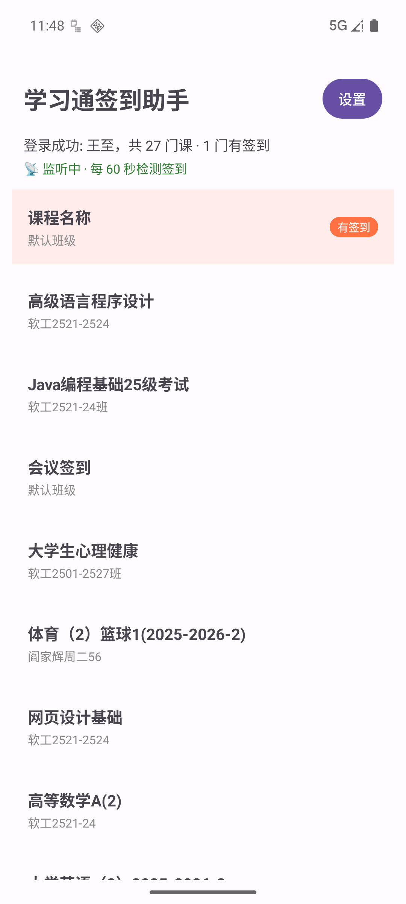
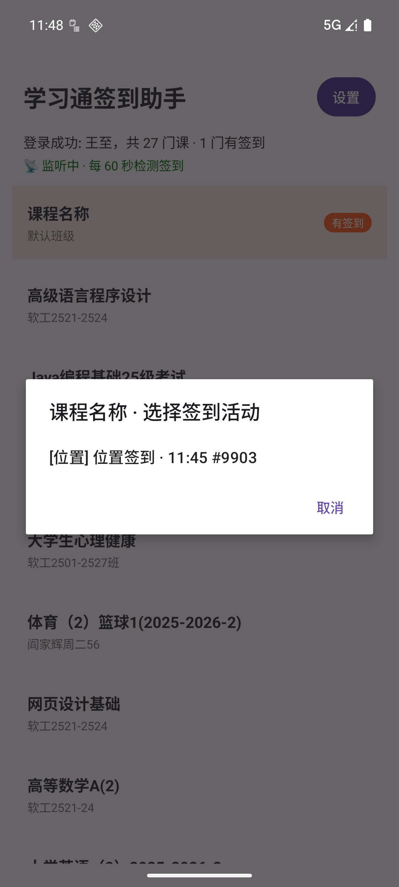
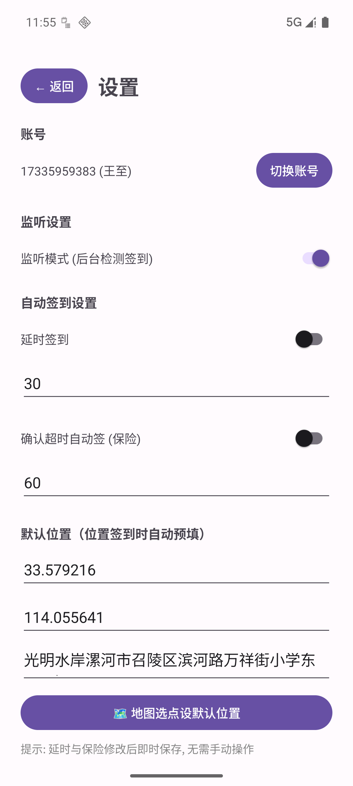
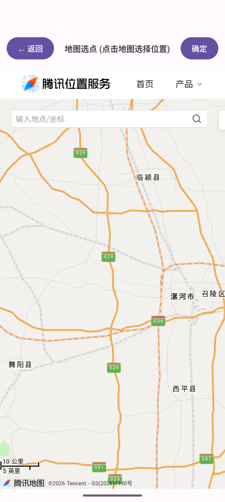

# 学习通签到助手 (Android)

基于学习通(超星)公开接口的 Android 原生签到工具。自动检测课程签到活动，支持**六种签到类型**全链路、**后台监听自动签**、**多活动二级选择**、**九宫格手势画板**、**地图选点定位**。

> ⚠️ **免责声明**: 本项目仅供学习 Android 开发与 HTTP 协议分析使用。请遵守课堂纪律，勿用本工具规避正常签到。

## 功能

| 功能 | 说明 |
|---|---|
| 登录 | 手机号+密码，DES-ECB 加密登录，**会话持久化免登录** |
| 课程列表 | RecyclerView 27 门课，有签到橙标置顶，已签灰标 |
| **多活动弹窗** | 同课多个签到 → AlertDialog 列出 `[类型] 名称 · HH:mm #id ✅`，点选签到 |
| 普通签到 | 一键提交 stuSignajax，实测 success |
| 拍照签到 | 云盘取 0.jpg/0.png 的 objectId 提交 |
| **手势签到** | **九宫格画板 GestureView**，Z 形 1235789 实测通过，中间点自动包含 |
| 签到码签到 | 数字输入 → checkSignCode 校验 → stuSignajax，码 1234/0721 实测 |
| **位置签到** | 手动输入 + **地图选点**（腾讯 lbs.qq.com/getPoint WebView，GCJ-02） |
| 二维码签到 | 手动输 enc，坐标复用设置页默认位置 |
| **监听模式** | 前台服务 60s 轮询 27 课，检测到通知提醒（**多活动不漏**） |
| 延时签到 | 检测到后等 N 秒自动签 |
| 确认保险 | 通知提醒 + 超时未确认自动签兜底 |
| **监听持久化** | force-stop 重启**自动恢复**监听服务 |
| **默认位置** | 设置页存默认坐标+地址，位置签到自动预填，二维码复用 |
| 账号切换 | 一键退出重登 |

## 界面

| 课程列表 | 多活动弹窗 | 位置签到页 | 设置页 |
|---|---|---|---|
|  |  |  |  |

| 地图选点 | 手势画板 |
|---|---|
|  |  |

## 使用

1. 打开 App，输入学习通账号密码登录（会话持久化，下次免登录）
2. 课程列表点击课程 → **弹出该课所有签到活动**（含时间戳和签过状态）
3. 选择活动进入签到页，按类型操作：
   - 普通/拍照：直接点签到
   - 手势：在九宫格画板画出老师手势（Z 形=1235789）
   - 签到码：输入数字码
   - 位置：预填默认位置，或点 🗺️ 地图选点精确定位
   - 二维码：输入 enc
4. 设置页打开**监听模式**（需通知权限），即使 App 在后台也会自动检测

## 技术架构

- **语言**: Java + XML 布局（无 Compose，零第三方网络库）
- **网络**: `HttpURLConnection` + Cookie 会话（`ChaoxingApi.java` 自包含协议层）
- **UI**: `RecyclerView` + `AlertDialog` + 自定义 `GestureView`
- **后台**: `SignMonitorService` 前台服务 + 独立轮询线程

```
app/src/main/java/com/example/chaoxingsign/
├── ChaoxingApi.java         # 协议层: DES登录/课程/活动检测/六种签到/会话持久化
├── MainActivity.java        # 首页: 自动登录/课程列表/多活动弹窗
├── SignActivity.java        # 签到页: 按类型签到/activeId直选/默认位置预填
├── SettingsActivity.java    # 设置: 监听/延时/保险/默认位置/监听持久化
├── SignMonitorService.java  # 监听服务: 60s轮询/多活动检测/通知(带课程名+activeId)
├── CourseAdapter.java       # 课程列表适配器(三态徽标)
├── GestureView.java         # 九宫格手势画板(3x3/中间点自动包含)
└── LocationPickerActivity.java # 地图选点(Tencent lbs.qq.com WebView)
```

## 关键逆向成果

| 项目 | 说明 |
|---|---|
| DES 密钥 | 前端 JS 16 字节，DES 取前 8 字节 `u2oh6Vu^` |
| 手势编码 | 九宫格 1-9（左上=1 横向），编码=经过点序列，对角穿中间点计入 |
| 手势破解 | Z 形黑盒爆破 `1235789`，checkSignCode 试错安全不封号 |
| 位置机制 | GCJ-02 坐标系，locationRange 500m，中心坐标 API 不下发 |
| **位置坐标逆向** | **梯度搜索破解**：多组"提交坐标→服务端返回距离"做三边测量+梯度下降，命中教师坐标 `33.579216,114.055641`（实测签到 success） |
| 多活动 | activelist 同课多活动遍历 + signedActivityIds 去重 |
| 地图选点 | 腾讯 lbs.qq.com/getPoint/ WebView 免 SDK/key；页面泄露 key `NQQBZ-...` 可直接调腾讯 suggestion API 精确定位 POI |

## 构建

```bash
# 环境: JAVA_HOME=Android Studio JBR, ANDROID_HOME=D:\Android\Sdk
./gradlew :app:assembleDebug
# APK: app/build/outputs/apk/debug/app-debug.apk
```

- **依赖**: 阿里云 Maven 镜像
- **Gradle** 9.5 + AGP 9.3 + minSdk 24 / targetSdk 37
- **模拟器**: AVD Pixel 7 / API 36，`emulator -avd test -gpu auto`

## 相关项目

- [chaoxing-sign](https://github.com/HEDBS/chaoxing-sign) — Python 命令行版（同协议），本项目的协议源头
- [chaoxing-sign-android](https://github.com/HEDBS/chaoxing-sign-android) — 本项目

## License

MIT
